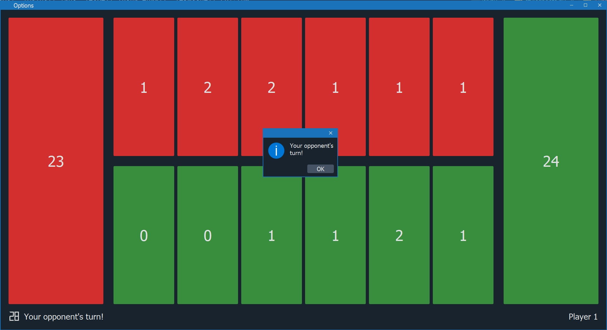

# Kalaha



## Installation
This game requires additional Python libraries. Install them using `pip` command.
```
pip install -r requirements.txt
```

## Running server

### From source

Use `server` argument to start the server. By running following command 
server will listen for connections on `127.0.0.1:20202` with turn timeout of `60` seconds.
```shell
python -m kalaha server -H 127.0.0.1 -p 20202 -tt 60
```
### Using Docker
Update environment variables in `docker-compose.yml` file and spin up containers.
```shell
docker-compose up
```

## Running client

### Human player

Start client and connect to `127.0.0.1:20202`
```shell
python -m kalaha client -H 127.0.0.1 -p 20202
```

### Auto player
__Note:__ You will not be able to make moves manually.

Start client, connect to `127.0.0.1:20202` and enable auto-play.
This command configures minimax algorithm to search for best move in tree of depth `4`.
Delay of auto move will be `5` seconds.
```shell
python -m kalaha client -H 127.0.0.1 -p 20202 -ap -apd 5 -md 4
```
You can disale alpha-beta pruning by passing `-nab` argument.
```shell
python -m kalaha client -H 127.0.0.1 -p 20202 -ap -apd 5 -md 4 -nab
```
You can enable iterative deepening by passing `-id` argument.
```shell
python -m kalaha client -H 127.0.0.1 -p 20202 -ap -apd 5 -md 4 -id
```


## FAQ

### What game modes are available?
Human vs. Human, Human vs. AI, AI vs. AI

### Is input validation done on the server side or client side?
Every move including pit selection is validated on the server side.

### How auto game works?
Autoplayer uses minimax algorithm to find the best move. Optimalizations were made to improve the performance
and win rate.
- iterative deepening
- alpha-beta pruning
- tree is generated level by level when minimax traverses the tree
- `Node` class is written in pure Python

__Important__: Algorithm is run on client side. It is running in separate thread, 
but setting high tree depth can cause the client to freeze and exceed the player's time limit.
Recommended tree depth is `4`.

### What Python libraries are used?
- qtpy - abstraction layer for PyQt5/PySide2
- PyQt5 - Qt5 bindings for Python
- [qrainbowstyle](https://github.com/desty2k/QRainbowStyleSheet) - custom windows and widgets style
- [QtPyNetwork](https://github.com/desty2k/QtPyNetwork) - high level network library
- coloredlogs - colored logging
